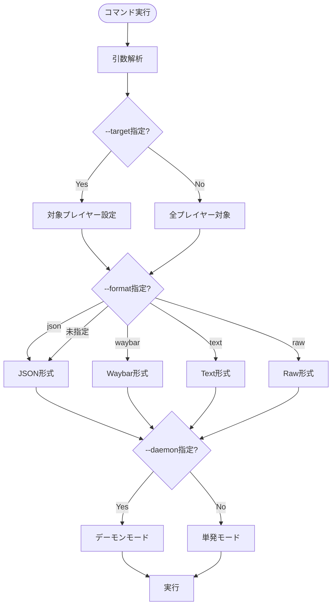
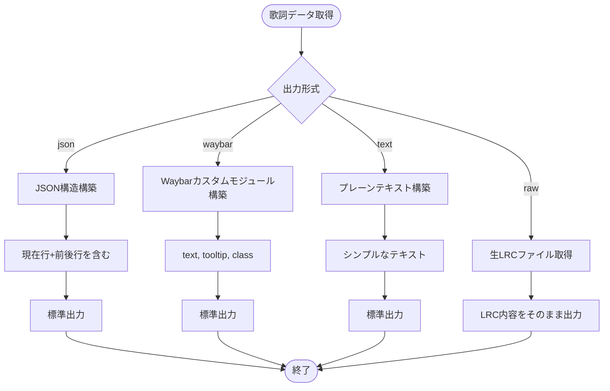
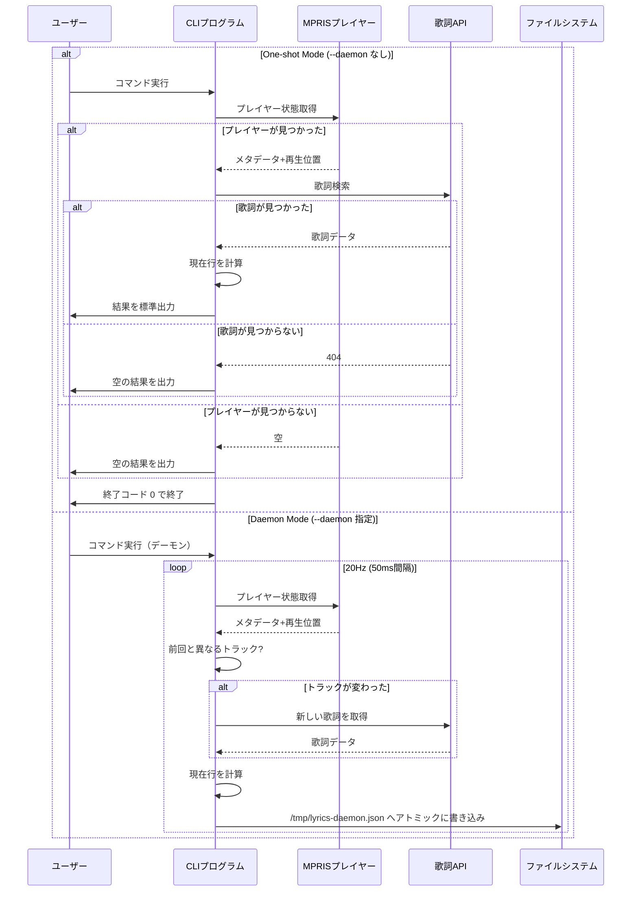

# Capability: CLI Interface

## Purpose
ツールの動作モード（デーモン/単発取得）や出力形式を制御するためのユーザーインターフェースを定義する。

## Requirements

### Requirement: Command Line Arguments
ユーザーはコマンドライン引数を通じて挙動を制御可能でなければならない (**MUST**)。

#### Process Flow

#### Scenario: Supported arguments
- **WHEN** コマンドライン引数が提供される
- **THEN** 以下の引数を受け入れなければならない:
    - `--target`: 対象とする特定のプレイヤー名（部分一致）
    - `--format`: 出力形式 (`json`, `waybar`, `text`, `raw`)
    - `--daemon`: 高リフレッシュレートのデーモンモードで実行

### Requirement: Output Formats
指定された形式に従って標準出力へ結果を書き出さなければならない (**MUST**)。

#### Process Flow

#### Scenario: JSON Format (Default)
- **WHEN** `--format json` が指定される
- **THEN** 現在の歌詞行とその前後を含むJSON構造を出力しなければならない。

#### Scenario: Waybar Format
- **WHEN** `--format waybar` が指定される
- **THEN** Waybarのカスタムモジュール用JSON（`text`, `tooltip`, `class`）を出力しなければならない。

#### Scenario: Raw Format
- **WHEN** `--format raw` が指定される
- **THEN** 取得されたLRCファイルの内容をそのまま出力しなければならない。

### Requirement: Execution Modes
単発実行モードとデーモンモードの2つのモードをサポートしなければならない (**MUST**)。

#### Process Flow

#### Scenario: One-shot Mode
- **WHEN** `--daemon` が指定されない
- **THEN** 現在の状態を一度だけ取得して終了しなければならない。
- **AND** プレイヤーが見つからない、または歌詞が見つからない場合でも終了コード `0` で正常終了しなければならない。

#### Scenario: Daemon Mode
- **WHEN** `--daemon` が指定される
- **THEN** 20Hz (50ms間隔) で再生位置を更新し続けなければならない。
- **AND** 結果を `/tmp/lyrics-daemon.json` へアトミックに書き込み続けなければならない。
