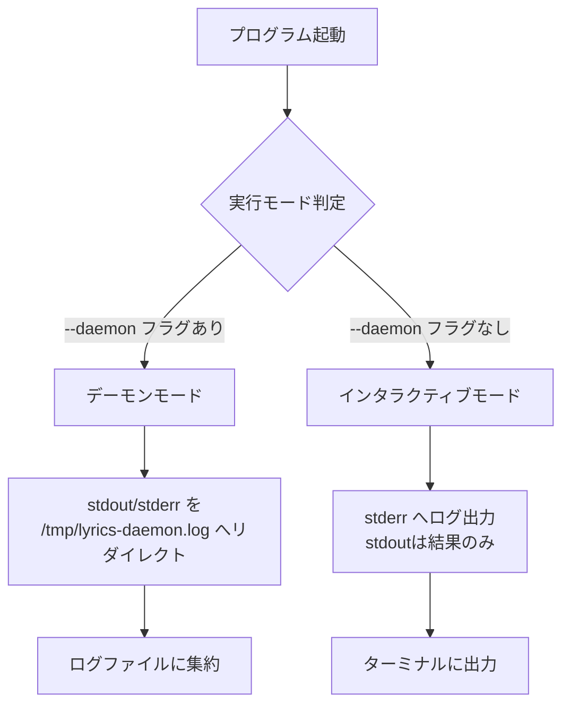
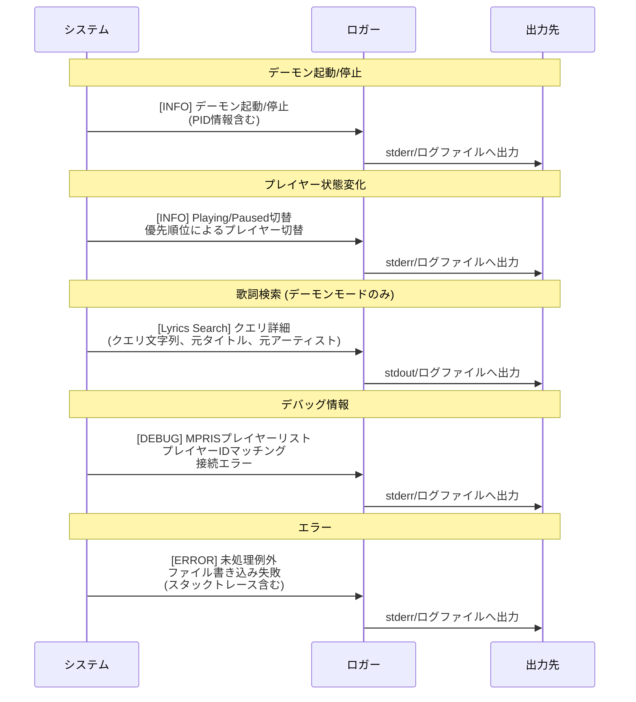
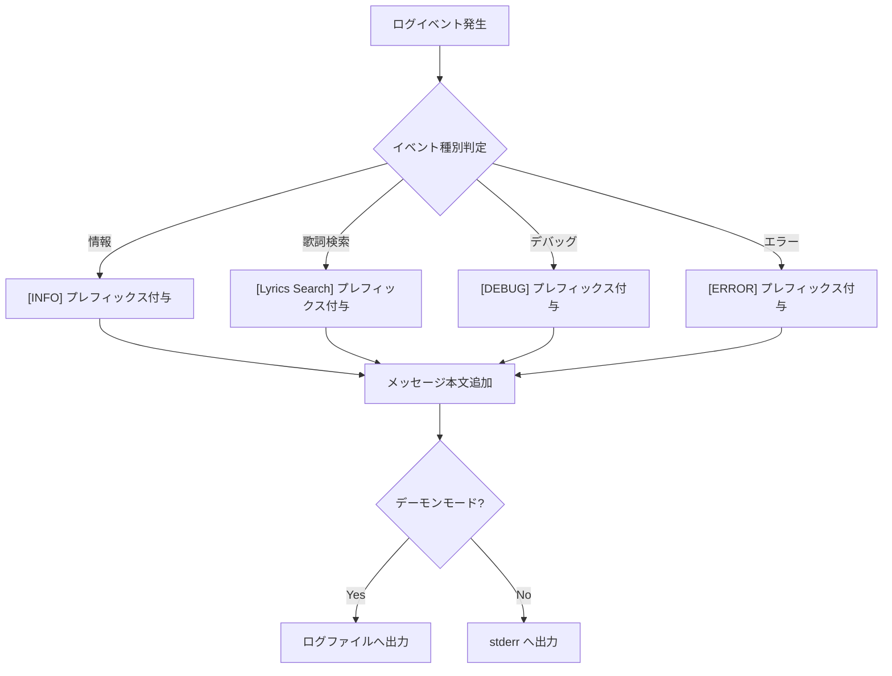

# Capability: Logging and Debugging

## Purpose
システムの稼働状況、検索クエリ、エラー発生時の詳細を記録し、トラブルシューティングを容易にする。

## Requirements

### Requirement: Log Destinations
実行モードに応じて適切な場所へログを出力しなければならない (**MUST**)。

#### Process Flow

#### Scenario: Daemon Logging
- **WHEN** デーモンモードで実行されている
- **THEN** 標準出力および標準エラー出力の両方を `/tmp/lyrics-daemon.log` に集約して記録しなければならない。

#### Scenario: Interactive Debugging
- **WHEN** ターミナルから直接実行されている
- **THEN** デバッグ情報やエラー情報を標準エラー出力 (`stderr`) に出力し、標準出力 (`stdout`) の結果を汚さないようにしなければならない。

### Requirement: Logged Events
以下の重要なイベントを適切なログレベルとプレフィックスで記録しなければならない (**MUST**)。

#### Process Flow

#### Scenario: Key events
- **WHEN** システムが動作する
- **THEN** 以下のイベントカテゴリに対応するプレフィックスを使用して記録しなければならない:
    - `[INFO]`:
        - デーモンの起動・停止（PID情報含む）
        - プレイヤーの再生状態変化（Playing ↔ Paused）
        - 優先順位によるプレイヤーの切り替え
    - `[Lyrics Search]`:
        - 検索実行時のクエリ詳細（クエリ文字列、元タイトル、元アーティスト）
        - ※デーモンモード実行時のみ出力
    - `[ERROR]`:
        - 未処理の例外（スタックトレース含む）
        - ファイル書き込み（PIDファイル、JSON出力）の失敗
    - `[DEBUG]`:
        - 利用可能なMPRISプレイヤーのリスト列挙
        - プレイヤーIDのマッチングプロセス
        - 個別のプレイヤー接続エラー

### Requirement: Log Format
ログメッセージは識別しやすいプレフィックスを含まなければならない (**MUST**)。

#### Process Flow

#### Scenario: Consistent Prefixing
- **WHEN** ログが出力される
- **THEN** メッセージの冒頭に `[INFO]`, `[ERROR]`, `[DEBUG]`, `[Lyrics Search]` のいずれかを付与し、カテゴリを明確に区別しなければならない。
