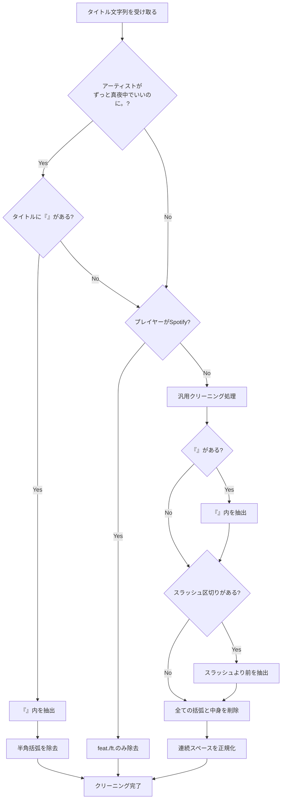
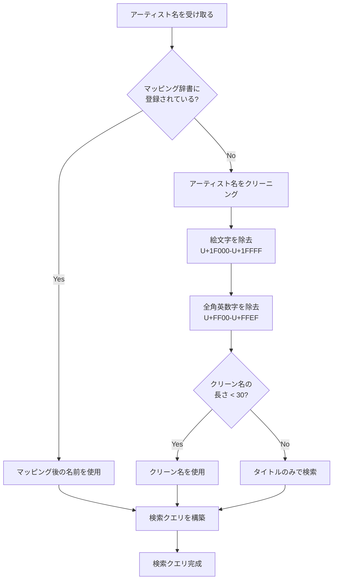
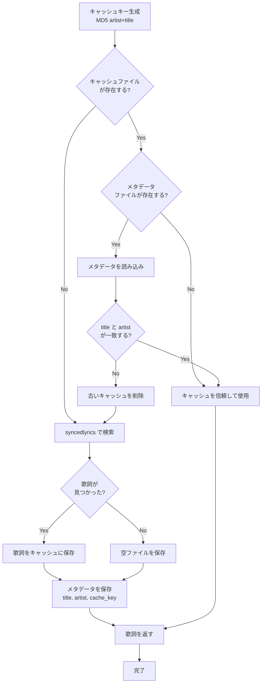

# Capability: Lyrics Fetching

## Purpose
メディアプレーヤーから取得した情報を検索エンジンに適した形式に変換し、同期された歌詞を取得・キャッシュする。

## Requirements

### Requirement: Title Cleaning
playerctlから取得した生のタイトル文字列から、不要な要素（[MV]、(feat. ...)、YouTubeの「 / 」区切りなど）を除去してクリーンな曲名を抽出 **SHALL** しなければならない。

#### Process Flow

#### Scenario: Prioritized extraction for specific artists
- **WHEN** アーティストが「ずっと真夜中でいいのに。 ZUTOMAYO」であり、タイトルに「『...』」が含まれる場合
- **THEN** 「『』」内のみを抽出し、さらに半角括弧を除去した時点でクリーニングを完了（早期リターン）しなければならない。

#### Scenario: Limited cleaning for Spotify
- **WHEN** メディアプレーヤーが「Spotify」である場合
- **THEN** `feat.` や `ft.` の除去のみを行い、他の汎用的なクリーニング処理（スラッシュ分割等）はスキップして終了しなければならない。

#### Scenario: General Flow - Extract from double brackets
- **WHEN** 上記の優先ルールに該当せず、タイトルに「『』」が含まれる場合
- **THEN** 「『』」内の中身を抽出する。

#### Scenario: General Flow - Truncate at slash separator
- **WHEN** タイトルに「 / 」（スペース+スラッシュ+スペース）が含まれる
- **THEN** 最初の区切り文字「 / 」より前の部分のみを抽出する。

#### Scenario: General Flow - Remove brackets and contents
- **WHEN** タイトルに「Song Title (Any Content) [Meta] 【補足】」のような括弧が含まれる
- **THEN** 半角・全角問わず、括弧とその中身を無条件に全て削除する。

### Requirement: Artist Mapping and Cleaning
検索精度向上のため、アーティスト名を正規化 **SHALL** しなければならない。

#### Process Flow

#### Scenario: Use predefined mapping
- **WHEN** アーティスト名が「ずっと真夜中でいいのに。 ZUTOMAYO」である
- **THEN** マッピングに基づき「ずっと真夜中でいいのに。」として検索される

#### Scenario: Remove emojis and full-width chars
- **WHEN** アーティスト名に絵文字や全角英数字が含まれる
- **THEN** それらを除去したクリーンな名前で検索される

### Requirement: Lyrics Caching
取得した歌詞はキャッシュ **MUST** し、不要なAPIリクエストを防止しなければならない。

#### Process Flow

#### Scenario: Valid cache hit
- **WHEN** キャッシュファイルが存在し、メタデータ（タイトル、アーティスト）が一致する
- **THEN** キャッシュされた歌詞を即座に返す

#### Scenario: Stale cache invalidation
- **WHEN** キャッシュはあるがメタデータが一致しない
- **THEN** キャッシュを削除して再検索を行う
