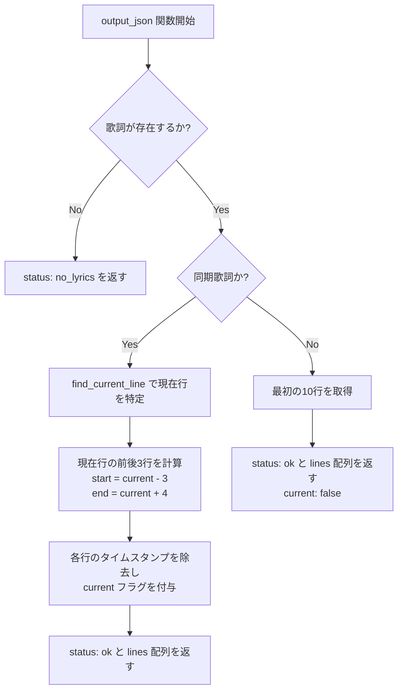
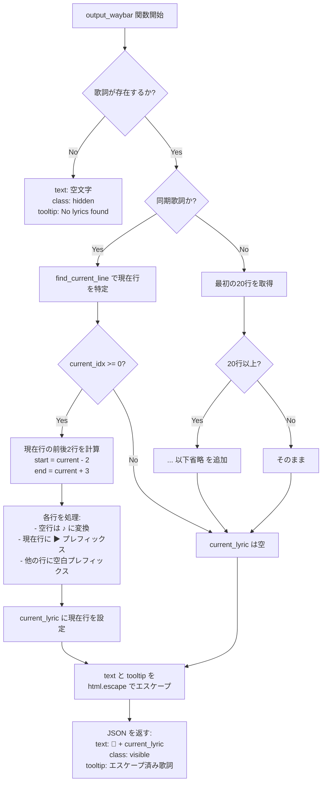

# Capability: Lyrics Output

## Purpose
取得した歌詞情報を、様々なデスクトップツール（Eww, Waybar, CLI）が解釈可能な形式で出力する。

## Requirements

### Requirement: Eww Output Format
Ewwなどのウィジェットで使用するためのJSON形式を出力 **SHALL** しなければならない。

#### Process Flow

#### Scenario: Current and surrounding lines
- **WHEN** 同期された歌詞を表示する
- **THEN** 現在の行を中心に前後数行を含むJSONを出力する

### Requirement: Waybar Output Format
Waybarのカスタムモジュール用JSON形式を出力 **SHALL** しなければならない。

#### Process Flow

#### Scenario: Escaped tooltip
- **WHEN** 歌詞をツールチップに表示する
- **THEN** HTML特殊文字をエスケープしたJSONを出力する
