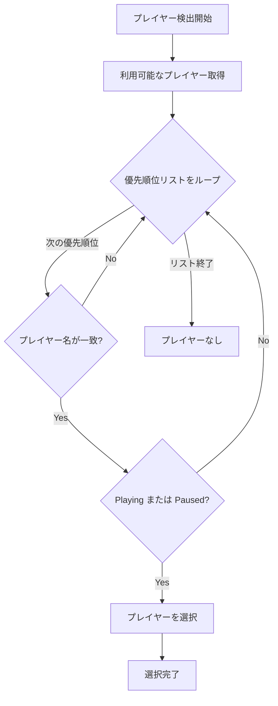
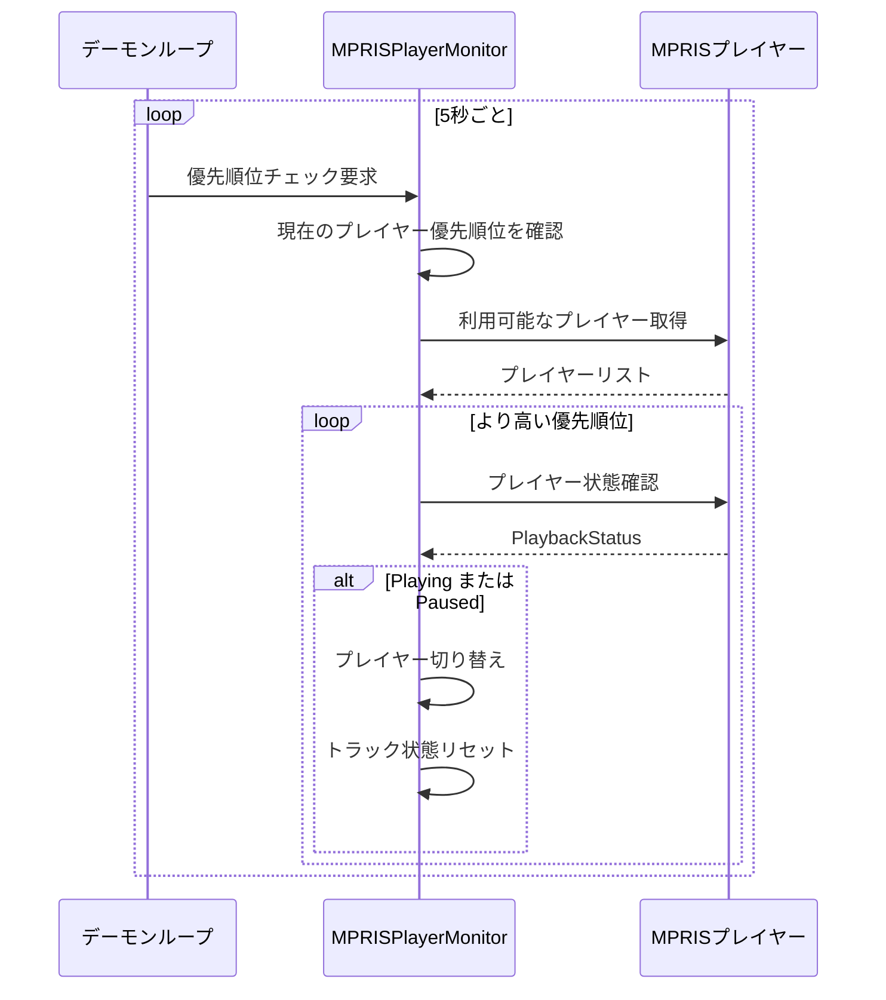
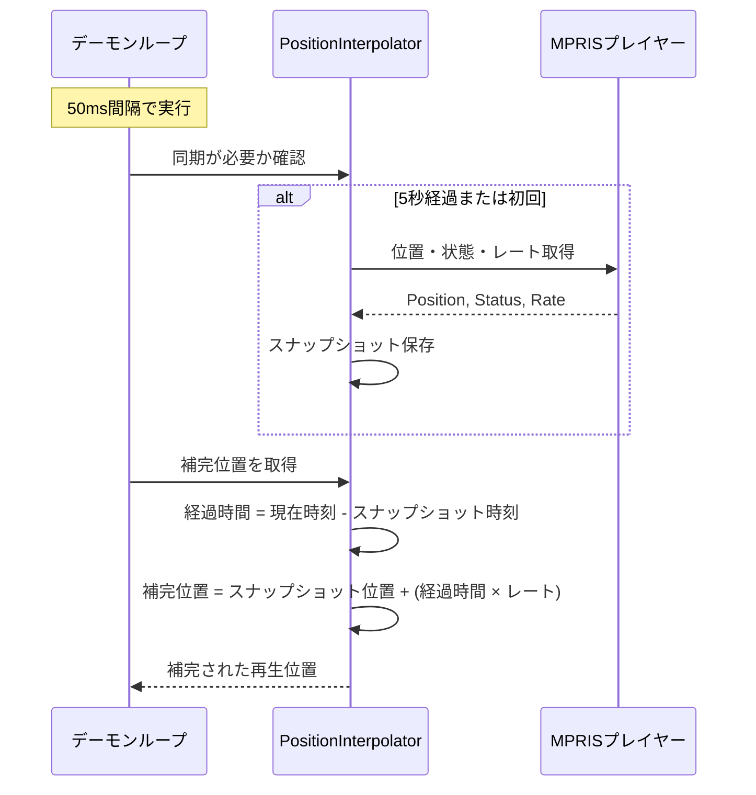
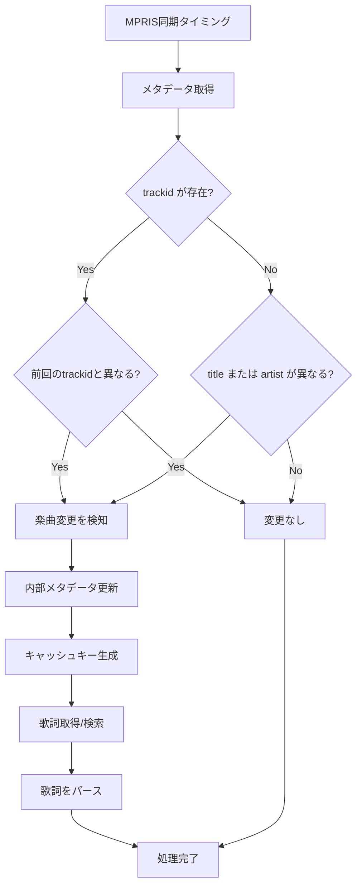
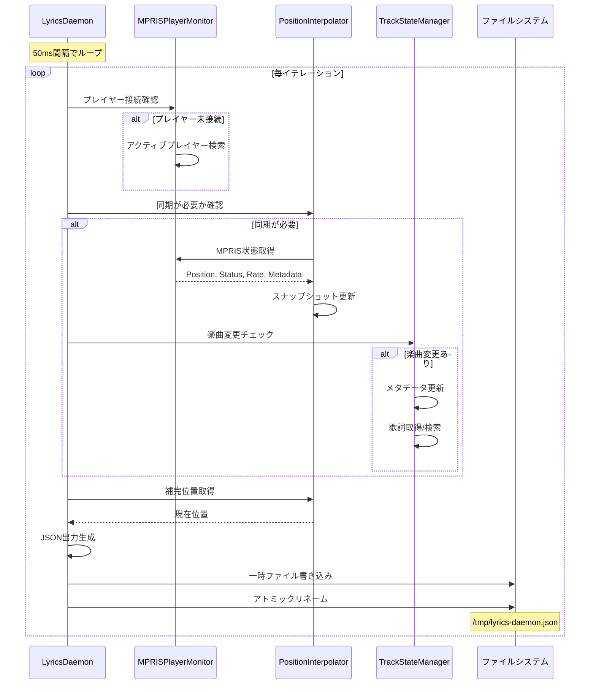

# Capability: MPRIS Monitor

## Purpose
MPRISインターフェースを介してメディアプレーヤーの状態を監視し、再生位置の管理とイベントの通知を行う。

## Requirements

### Requirement: Player Detection
再生中のメディアプレーヤーを優先順位に従って検出 **SHALL** しなければならない。

#### Process Flow

#### Scenario: Priority matching
- **WHEN** 「brave」と「spotify」の両方が起動している
- **THEN** 「brave」が優先的に選択される

#### Scenario: Priority Re-check
- **WHEN** デーモンモードで動作している
- **THEN** 5秒ごとに、現在よりも優先順位の高いプレイヤーが再生を開始していないか確認しなければならない。
- **AND** より高い優先順位のプレイヤーが見つかった場合、即座に接続先を切り替えなければならない。

#### Process Flow

### Requirement: Position Interpolation
MPRISへの負荷を抑えるため、再生位置を補完 **SHALL** しなければならない。

#### Process Flow

#### Scenario: Smooth interpolation
- **WHEN** MPRISとの同期が5秒間隔である
- **THEN** その間はシステム時刻の変化に基づき再生位置をミリ秒単位で更新する

### Requirement: Track Change Detection
再生中の楽曲が変更されたことを正確に検知し、メタデータを更新しなければならない (**MUST**)。

#### Process Flow

#### Scenario: Sync Interval
- **WHEN** デーモンモードで動作している
- **THEN** 5秒ごとのMPRIS同期のタイミングで楽曲変更を確認しなければならない。

#### Scenario: Detection Logic
- **WHEN** 楽曲変更を確認する
- **THEN** 以下の優先順位で変更を判定しなければならない:
    1. `mpris:trackid` が前回のIDと異なる場合
    2. トラックIDが無い場合、`xesam:title` または `xesam:artist` が前回の値と異なる場合

#### Scenario: Action on Change
- **WHEN** 楽曲の変更が検知される
- **THEN** 直ちに内部のメタデータ（タイトル、アーティスト）を更新しなければならない。
- **AND** 新しいメタデータに基づいて歌詞の再取得（キャッシュ確認または新規検索）を実行しなければならない。

### Requirement: Daemon Execution
継続的な監視を行い、結果を外部ファイルへ出力 **MUST** しなければならない。

#### Process Flow

#### Scenario: Atomic file update
- **WHEN** デーモンが新しい歌詞情報を生成する
- **THEN** `/tmp/lyrics-daemon.json` へアトミックに書き込みを行う
